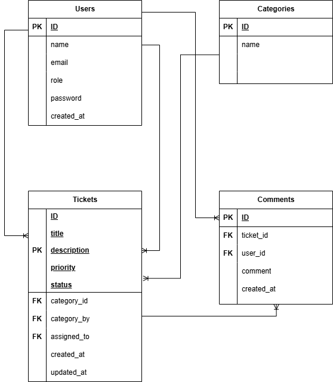
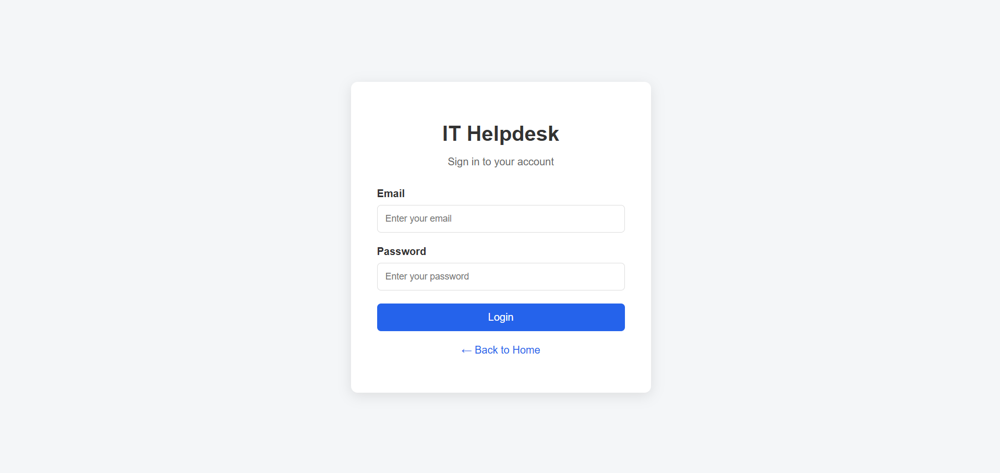
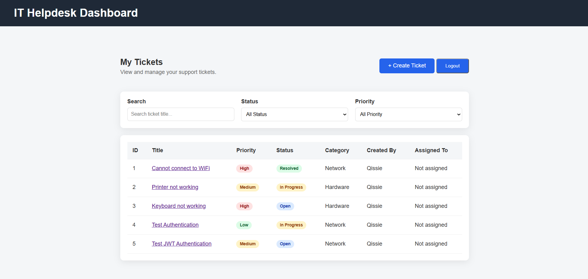
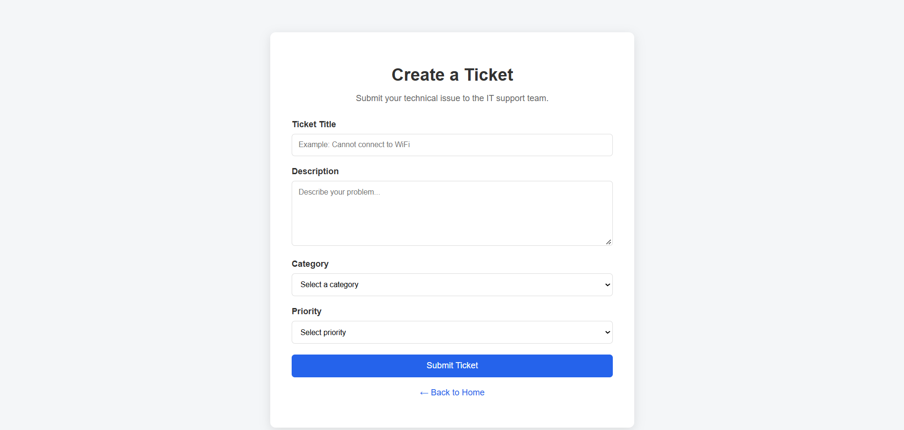
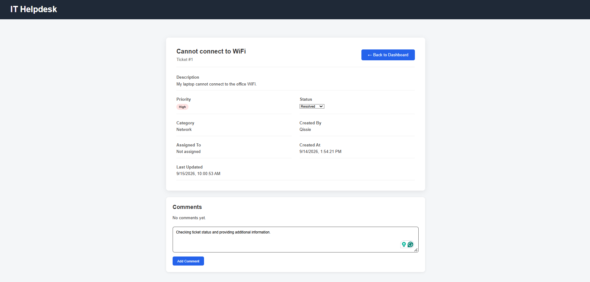
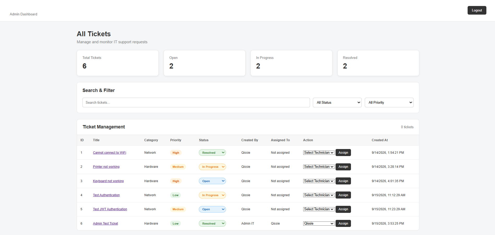

# IT Helpdesk Ticketing System

A web-based IT Helpdesk Ticketing System developed to manage IT support requests, track ticket status, assign technicians, and facilitate communication between users and IT support staff.

## Features

### User

* User login authentication
* Create IT support tickets
* View personal tickets
* Search and filter tickets
* View ticket details
* Update ticket status
* Add comments to tickets

### Admin / IT Support

* Admin authentication and role-based access
* View all support tickets
* Search and filter tickets
* Assign tickets to technicians
* Update ticket status
* View ticket details and comments

### Security

* Password hashing using bcrypt
* JWT-based authentication
* Role-based authorization
* Protected API routes
* Environment variables for sensitive configuration

## Tech Stack

**Frontend**

* HTML
* CSS
* JavaScript

**Backend**

* Node.js
* Express.js

**Database**

* MySQL

**Authentication**

* JSON Web Token (JWT)
* bcrypt

**Development Tools**

* Visual Studio Code
* Git
* GitHub

## System Architecture

```text
User Browser
     ↓
HTML / CSS / JavaScript
     ↓
REST API
     ↓
Node.js + Express.js
     ↓
MySQL Database
```

## Database

The system uses MySQL with the following main tables:

* `users`
* `categories`
* `tickets`
* `comments`

The `tickets` table stores support requests, while `comments` stores communication related to each ticket.

## Main API Endpoints

| Method | Endpoint                    | Description                         |
| ------ | --------------------------- | ----------------------------------- |
| POST   | `/api/login`                | User authentication                 |
| GET    | `/api/tickets`              | Retrieve tickets based on user role |
| GET    | `/api/tickets/:id`          | Retrieve ticket details             |
| POST   | `/api/tickets`              | Create a new ticket                 |
| PATCH  | `/api/tickets/:id/status`   | Update ticket status                |
| PATCH  | `/api/tickets/:id/assign`   | Assign technician                   |
| GET    | `/api/users`                | Retrieve available technicians      |
| GET    | `/api/tickets/:id/comments` | Retrieve ticket comments            |
| POST   | `/api/tickets/:id/comments` | Add a ticket comment                |

**Authentication**

Requires a valid JWT token in the request header.

```text
Authorization: Bearer JWT_TOKEN
```

**Request Body**

```json
{
  "title": "Computer cannot connect to Wi-Fi",
  "description": "The computer is unable to connect to the office Wi-Fi.",
  "priority": "High",
  "category_id": 1
}
```

**Response — 201 Created**

```json
{
  "message": "Ticket created successfully",
  "ticketId": 7
}
```

**Access Control**

* Authenticated users can create support tickets.
* The ticket creator is automatically identified from the authenticated user.

---

### Update Ticket Status

#### PATCH `/api/tickets/:id/status`

Update the status of a support ticket.

**Authentication**

Requires a valid JWT token in the request header.

```text
Authorization: Bearer JWT_TOKEN
```

**Request Body**

```json
{
  "status": "In Progress"
}
```

**Response — 200 OK**

```json
{
  "message": "Ticket status updated successfully"
}
```

**Allowed Statuses**

* Open
* In Progress
* Resolved
* Closed

**Access Control**

* Admin users can update any ticket.
* Regular users can update their own tickets.

---

### Assign Technician

#### PATCH `/api/tickets/:id/assign`

Assign a support ticket to a technician.

**Authentication**

Requires a valid JWT token in the request header.

```text
Authorization: Bearer JWT_TOKEN
```

**Request Body**

```json
{
  "assigned_to": 1
}
```

**Response — 200 OK**

```json
{
  "message": "Technician assigned successfully"
}
```

**Access Control**

* Only admin users can assign technicians.

---

### Get Available Technicians

#### GET `/api/users`

Retrieve the available technicians in the system.

**Authentication**

Requires a valid JWT token in the request header.

```text
Authorization: Bearer JWT_TOKEN
```

**Response — 200 OK**

```json
[
  {
    "id": 1,
    "name": "Demo User",
    "email": "demo@example.com",
    "role": "user"
  }
]
```

**Access Control**

* Only admin users can retrieve the technician list.

---

### Get Ticket Comments

#### GET `/api/tickets/:id/comments`

Retrieve all comments associated with a specific ticket.

**Authentication**

Requires a valid JWT token in the request header.

```text
Authorization: Bearer JWT_TOKEN
```

**Response — 200 OK**

```json
[
  {
    "id": 1,
    "comment": "Testing ticket comment system",
    "created_at": "2026-09-17T10:00:00.000Z",
    "user_name": "Admin IT",
    "user_role": "admin"
  }
]
```

**Access Control**

* Admin users can view comments on any ticket.
* Regular users can view comments only on their own tickets.

---

### Add Ticket Comment

#### POST `/api/tickets/:id/comments`

Add a comment to a specific support ticket.

**Authentication**

Requires a valid JWT token in the request header.

```text
Authorization: Bearer JWT_TOKEN
```

**Request Body**

```json
{
  "comment": "The issue has been checked and is currently being investigated."
}
```

**Response — 201 Created**

```json
{
  "message": "Comment added successfully"
}
```

**Access Control**

* Admin users can add comments to any ticket.
* Regular users can add comments only to their own tickets.


## Ticket Workflow

```text
Open
  ↓
In Progress
  ↓
Resolved
  ↓
Closed
```


## Ticket Priorities

* Low
* Medium
* High
* Critical

## Ticket Categories

* Network
* Hardware
* Software
* Account
* Other

## How to Run Locally

### 1. Clone the repository

```bash
git clone https://github.com/Qistina-03/IT-Helpdesk-System.git
```

### 2. Open the project

```bash
cd IT-Helpdesk-System
```

### 3. Install dependencies

```bash
npm install
```

### 4. Configure environment variables

Create a `.env` file in the project root:

```env
JWT_SECRET=your-secret-key
```

### 5. Configure MySQL

Create a MySQL database named:

```text
it_helpdesk
```

Then create the required tables:

* `users`
* `categories`
* `tickets`
* `comments`

Update the MySQL connection settings in `db.js` according to your local environment.

### 6. Start the server

```bash
node server.js
```

The application will run at:

```text
http://localhost:3000
```

## Project Structure

```text
IT-Helpdesk-System/
│
├── public/
│   ├── css/
│   │   └── style.css
│   │
│   ├── js/
│   │   ├── admin-dashboard.js
│   │   ├── create-ticket.js
│   │   ├── dashboard.js
│   │   ├── login.js
│   │   └── ticket-details.js
│   │
│   ├── admin-dashboard.html
│   ├── create-ticket.html
│   ├── dashboard.html
│   ├── index.html
│   ├── login.html
│   └── ticket-details.html
│
├── .env
├── .gitignore
├── db.js
├── package.json
├── package-lock.json
└── server.js
```

> Note: `.env` and `node_modules` are excluded from Git using `.gitignore`.

## Project Purpose

This project was developed as a portfolio project to practise full-stack web development concepts including REST APIs, database integration, authentication, authorization, CRUD operations, and frontend-backend communication.

## Future Improvements

* User registration
* Ticket deletion and editing
* Ticket activity history
* Email notifications
* File attachments
* Dashboard statistics
* Improved input validation
* Production deployment
* Enhanced security and error handling

## Screenshots

### Entity Relationship Diagram


### Login Page


### User Dashboard


### Create Ticket


### Ticket Details


### Admin Dashboard


## Author

**Qistina**

GitHub: https://github.com/Qistina-03
